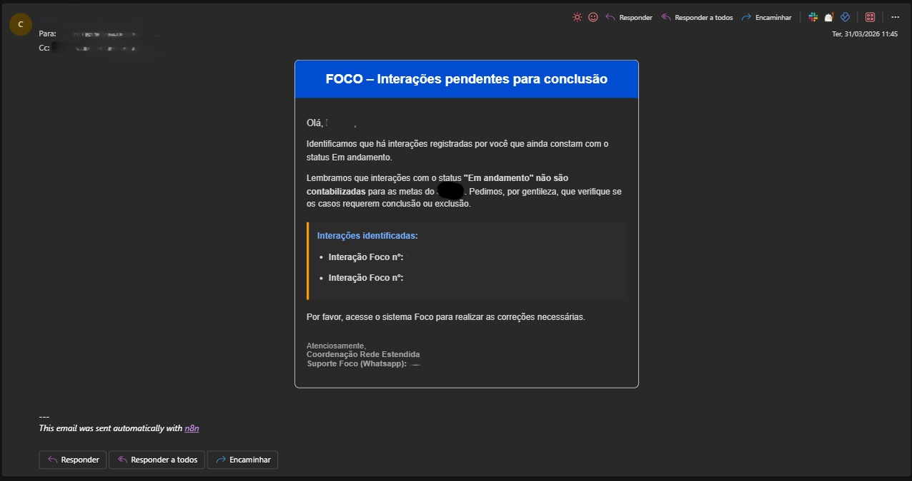

# Hybrid SLA & Compliance Monitoring System | Sistema Híbrido de Monitoramento

  <video src="https://raw.githubusercontent.com/yagovinicius/n8n-hybrid-sla-monitoring/main/demonstration.mp4" width="100%" controls autoplay loop muted>
  </video>

 

## 🇺🇸 English
### 📝 Description
A high-performance hybrid automation built with **n8n** to audit operational inconsistencies and SLA breaches. The system unifies overdue service monitoring and fiscal compliance auditing (inactive tax IDs) into a single intelligent ecosystem.

### ⚙️ Architectural Decisions
* **Unified Workflow:** Designed as a single stream to ensure easy maintenance and centralized business logic.
* **Performance:** Processed months of backlog (hundreds of errors) in just **3m 12s** during its initial run.
* **Data Integrity:** Integrated with **Supabase** to ensure every event generates a structured log for BI analysis.

---

## 🇧🇷 Português
### 📝 Descrição
Sistema híbrido de alta performance desenvolvido no **n8n** para auditar inconsistências operacionais e quebras de SLA. A solução unifica o monitoramento de atendimentos atrasados e a auditoria de conformidade fiscal (CNPJs baixados) em um único ecossistema inteligente.

### ⚙️ Decisões de Arquitetura
* **Fluxo Unificado:** Projetado como uma esteira única para facilitar a manutenção e centralizar as regras de negócio.
* **Performance:** Processou meses de pendências acumuladas em apenas **3min 12s** na primeira execução.
* **Integridade de Dados:** Integração nativa com **Supabase** para garantir que cada evento gere um log estruturado para futura análise em Dashboards de BI.

---
### 🖼️ Preview

